# Dateneingabe und -ausgabe mit Java

Dateneingabe und -ausgabe sind zwei wichtige Funktionen, die alle Arten von Programmen unterstützen müssen.
Die Standardbibliothek der Java Laufzeitumgebung bietet einige grundlegende Elemente für Ein- und Ausgabe.
Im Folgenden betrachten wir diese beiden Aspekte:

* Ein- und Ausgabe von **Rohdaten**
* Ein- und Ausgabe von **Zeichenketten**

## Ein- und Ausgabe von Rohdaten

### Eingabe von Rohdaten

Die Eingabe von Rohdaten erfolgt grundsätzlich über sogenannte *Eingabeströme*, welche in Java durch die abstrakte Klasse `InputStream` repräsentiert werden.
In diesem ersten Abschnitt betrachten wir das Einlesen von Rohdaten von der Konsoleneingabe als auch von Dateien auf der Festplatte.
Die Konsoleneingabe wird durch das statische Feld `in` der Klasse `System` aus dem Paket `java.lang` ermöglicht.
Die Dateieingabe wird hingegen durch Instanzen der Klasse `FileInputStream` aus dem Paket `java.io` ermöglicht.
Diese Zusammenhänge sind noch einmal im folgenden Klassendiagramm dargestellt.



#### Konsoleneingabe von Rohdaten

Das erste Beispiel zeigt, wie man Rohdaten (d.h. einzelne Bytes) von der Konsoleneingabe liest.
Für das Lesen einzelner Bytes bietet die Klasse `InputStream` die Methode `read()`.
Die Methode liefert den Wert des jeweils nächsten Bytes aus dem Eingabestrom.
Wenn das Ende des Eingabestroms erreicht ist, liefert die Methode `read()` den Wert `-1`.

```java
import java.lang.System;

// Einzelne Bytes von Konsoleneingabe lesen
System.in.read()
System.in.read()
System.in.read()
```

#### Dateieingabe von Rohdaten

Das zweite Beispiel zeigt, wie man Rohdaten von einer Datei auf der Festplatte liest.
Für das Auslesen einer Datei muss zunächst eine Instanz der Klasse `FileInputStream` erzeugt werden.
Dieser Instanz muss der Dateipfad übergeben werden, der gelesen werden soll.
Der Dateipad kann dabei entweder absolut oder relativ zur aktuellen Arbeitsverzeichnis sein.
Wenn die Datei nicht existiert, löst der Konstruktor eine Ausnahme vom Typ `FileNotFoundException` aus.
Wenn die Datei existiert, können danach einzelne Bytes mit der Methode `read()` ausgelesen werden.
Wenn die Eingabe beendet ist, muss der Eingabestrom mit der Methode `close()` geschlossen werden.

```java
import java.io.FileInputStream;

// Datei zum Lesen öffnen
FileInputStream in = new FileInputStream("pfad.ext");

// Einzelne Bytes aus Datei lesen
in.read();
in.read();
in.read();

// Datei wieder schließen
in.close();
```

### Ausgabe von Rohdaten

Die Ausgabe von Rohdaten erfolgt grundsätzlich über sogenannte *Ausgabeströme*, welche in Java durch die abstrakte Klasse `OutputStream` repräsentiert werden.
In diesem ersten Abschnitt betrachten wir das Schreiben von Rohdaten in die Konsolenausgabe als auch in Dateien auf der Festplatte.
Die Konsolenausgabe wird durch das statische Feld `out` der Klasse `System` aus dem Paket `java.lang` ermöglicht.
Die Dateiausgabe wird hingegen durch Instanzen der Klasse `FileOutputStream` aus dem Paket `java.io` ermöglicht.
Diese Zusammenhänge sind noch einmal im folgenden Klassendiagramm dargestellt.



#### Konsolenausgabe von Rohdaten

Das erste Beispiel zeigt zunächst wieder, wie man einzelne Bytes auf die Konsolenausgabe schreibt.
Die Konsolenausgabe kann über einen Ausgabestrom zugegriffen, der von der Klasse `System` aus dem Paket `java.lang` bereitgestellt wird.
Der Ausgabestrom implementiert die Schnittstelle `OutputStream`, welche wiederum die Methode `write(int value)` anbietet. 

```java
import java.lang.System;

// Einzelne Bytes in Konsolenausgabe schreiben
System.out.write(10);
System.out.write(31);
System.out.write(96);
```

#### Dateiausgabe von Rohdaten

Das zweite Beispiel zeigt hingegen, wie man einzelne Bytes in eine Datei auf der Festplatte schreiben kann.
Für die Dateiausgabe bietet Java die Klasse `FileOutputStream` im Paket `java.io` an.
Wenn man eine Instanz dieser Klasse erzeugt, kann man den Dateipfad angeben, der zum Schreiben geöffnet werden soll.
Der Konstruktor kann prinzipiell eine `FileNotFoundException` werfen, wenn z.B. ein Order des Dateipfads nicht existiert.
Nachdem der Ausgabestrom erfolgreich erzeugt wurde, können wieder einzelne Bytes in die Datei geschrieben werden.
Wenn die Ausgabe beendet ist, sollte der Strom mit der Methode `close()` wieder geschlossen werden.

```java
import java.io.FileOutputStream;

// Datei zum Schreiben öffnen
FileOutputStream out = new FileOutputStream("pfad.ext");

// Einzelne Bytes in Datei schreiben
out.write(1);
out.write(25);
out.write(125);

// Datei wieder schließen
out.close();
```

## Ein- und Ausgabe von Zeichenketten

### Eingabe von Zeichenketten

Viele Anwendungen möchten Bytes ein- und ausgeben, sondern möchten stattdessen Zeichenketten verarbeiten.
Wie du bereits wissen solltest, benötigt man für die Umwandlung von Bytes in Zeichenketten eine zugehörige Zeichencode-Tabelle (z.B. ASCII oder UTF-8).
Des Weiteren sollte das Programm, das die Daten schreibt, mit derselben Zeichencode-Tabelle arbeiten wie das Programm, das die Daten wieder einliest.
Java bietet für die Ein- und Ausgabe von Zeichenketten das Konzept der `Reader` und `Writer` im Paket `java.io` an, welches technisch auf dem Konzept der Eingabe- und Ausgabeströme basiert.



#### Konsoleneingabe von Zeichenketten

TODO

```java
import java.lang.System;
import java.io.InputStreamReader;

// InputStream in Reader konvertieren
InputStreamReader reader = new InputStreamReader(System.in);

// Einzelne Zeichen aus Konsole lesen
reader.read();
reader.read();
reader.read();
```

TODO

```java
import java.io.BufferedReader;

// Reader in BufferedReader konvertieren
BufferedReader buffered = new BufferedReader(reader);

// Einzelne Zeilen aus Konsole lesen
buffered.readLine();
buffered.readLine();
buffered.readLine();
```

#### Dateieingabe von Zeichenketten

TODO

```java
import java.io.FileReader;

// Datei zum Lesen öffnen
FileReader reader = new FileReader("pfad.ext");

// Einzelne Zeichen aus Datei lesen
reader.read();
reader.read();
reader.read();

// Datei schließen
reader.close();
```

TODO

```java
import java.io.BufferedReader;

// Reader in BufferedReader konvertieren
BufferedReader buffered = new BufferedReader(reader);

// Einzelne Zeilen aus Datei lesen
buffered.readLine();
buffered.readLine();
buffered.readLine();

// Datei schließen
buffered.close();
```

### Ausgabe von Zeichenketten

TODO



#### Konsolenausgabe von Zeichenketten

TODO

```java
import java.lang.System;

// Einzelne Zeichenketten in Konsole schreiben
System.out.print("String");
System.out.print("String");
System.out.print("String");
```

#### Dateiausgabe von Zeichenketten

TODO

```java
import java.io.FileWriter;

// Datei zum Schreiben öffnen
FileWriter writer = new FileWriter("pfad.ext");

// Einzelne Zeichenketten in Datei schreiben
writer.write("String");
writer.write("String");
writer.write("String");

// Datei schließen
writer.close();
```