# IP-Kommunikation mit Java

TODO

* User Datagram Protokoll (UDP)
* Transmission Control Protokoll (TCP)

## User Datagram Protokoll (UDP)

TODO


### UDP-Pakete senden

TODO

```java
// IP-Adresse des Empfängers festlegen
InetAddress address = ...

// Portnummer des Empfängers festlegen
int port = ...

// Inhalt des UDP-Pakets festlegten
byte[] data = ...

// UDP-Paket erzeugen
DatagramPacket packet = new DatagramPacket()
packet.setAddress(address)
packet.setPort(port)
packet.setData(data)

// UDP-Paket senden
DatagramSocket socket = new DatagramSocket()
socket.send(packet)
```

### UDP-Pakete empfangen

TODO

```java
// Portnummer für das Empfangen festlegen
int port = ...

// Größe des Buffer festlegen
int size = ...

// Buffer anlegen
byte[] buffer = new byte[size]

// Leeres UDP-Paket erzeugen
DatagramPacket packet = new DatagramPacket()
packet.setData(buffer)

// UDP-Paket empfangen und befüllen
DatagramSocket socket = new DatagramSocket(port)
socket.receive(packet)
```

## Transmission Control Protokoll (TCP)

TODO



### TCP-Client erstellen

TODO

```java
// Client
```

### TCP-Server erstellen

TODO

```java
// Server
```