# IP-Kommunikation mit Java

Moderne Softwreprodukte arbeiten in der Regel nicht mehr isoliert, sondern kommunizieren mit anderen Softwaresystemen weltweit.
Die Kommunikation erfolgt dabei typischerweise über das Internet Protokoll (IP), welches das die Adressierung und das Routing übernimmt.
Jedoch setzten Anwendungen normalerweise nicht direkt auf IP auf, sondern nutzen stattdessen eines der beiden folgenden Protokolle, welche auf IP aufbauen:

1. User Datagram Protokoll (UDP)
1. Transmission Control Protokoll (TCP)

## 1. User Datagram Protokoll (UDP)

Das folgende Diagramm zeigt die Klassen, welche Java für die Kommunikation mit dem User Datagram Protokoll bereitstellt.
Die für die Kommunikation benötigten IP-Adressen werden durch die Klasse `InetAddress` dargestellt.
Diese Klasse stellt insbesondere die einzelnen Bytes einer IP-Adresse bereit; die Anzahl der Bytes ist dabei abhängig von der IP-Version.
Ein UDP-Datagram wird hingegen durch die Klasse `DatagramPacket` dargestellt, welche die IP-Adresse, einen Port, und die Nutzdaten beinhaltet.
Schließlich kann die Klasse `DatagramSocket` verwendet werden, um UDP-Datagramme zu senden und zu empfangen.



### 1.1. UDP-Pakete senden

Das folgende Beispiel zeigt, wie man mit den vorhin eingeführten Klassen ein UDP-Datagram an eine definierte IP-Adresse und einen definierten Port sendet.
Das Beispiel erzeugt zunächst eine Instanz der Klasse `DatagramPacket` und setzt die IP-Adresse und die Portnummer des Empfängers sowie die Nutzdaten.
Danach erzeugt das Beispiel eine Instanz der Klasse `DatagramSocket`, welches für das Senden des UDP-Datagramms verantwortlich ist.

```java
// IP-Adresse des Empfängers festlegen
InetAddress address = ...

// Portnummer des Empfängers festlegen
int port = ...

// Inhalt des UDP-Pakets festlegten
byte[] data = ...

// UDP-Paket erzeugen
DatagramPacket packet = new DatagramPacket()
packet.setAddress(address)
packet.setPort(port)
packet.setData(data)

// UDP-Paket senden
DatagramSocket socket = new DatagramSocket()
socket.send(packet)
```

### 1.2. UDP-Pakete empfangen

TODO

```java
// Portnummer für das Empfangen festlegen
int port = ...

// Größe des Buffer festlegen
int size = ...

// Buffer anlegen
byte[] buffer = new byte[size]

// Leeres UDP-Paket erzeugen
DatagramPacket packet = new DatagramPacket()
packet.setData(buffer)

// UDP-Paket empfangen und befüllen
DatagramSocket socket = new DatagramSocket(port)
socket.receive(packet)
```

## 2. Transmission Control Protokoll (TCP)

TODO


### 2.1. TCP-Client erstellen

TODO

```java
// Client
```

### 2.2. TCP-Server erstellen

TODO

```java
// Server
```