# 2D-Visualisierungen mit JavaFX

Knoten

* `Canvas` - *TODO*
* `Shape` - *TODO*

Leinwände

* `GraphicsContext` - *TODO*

Formen

* `Line` - Gerade Linie zwischen zwei Punkten
* `Polyline` - Linienzug zwischen zwei oder mehr Punkten
* `Rectangle` - Rechteckt definiert durch Höhe und Breite
* `Polygon` - Vieleck definiert durch eine Reihe von Punkten
* `Circle` - Kreis definiert durch Mittelpunkt und Radius
* `Ellipse` - Ellipse definiert durch Mittelpunkt und Radii
* `Text` - Text definiert durch Zeichenkette und Schriftart

Eltern

* `Group` - *TODO*

Regionen

* `Chart` - *TODO*
* `Axis` - *TODO*

Diagramme

* `PieChart` - *TODO*
* `XYChart` - *TODO*

## 1. Knoten

TODO

## 2. Leinwände

TODO

## 3. Formen

TODO

### 3.1. Linien

TODO

### 3.2. Linenzüge

TODO

### 3.3. Rechtecke

TODO

### 3.4. Polygone

TODO

### 3.5. Kreise

TODO

### 3.6. Ellipsen

TODO

### 3.7. Texte

TODO

## 4. Eltern

TODO

## 5. Regionen

TODO

## 5. Diagramme

TODO

### 5.1. Kreisdiagramme

TODO

### 5.2. Liniendiagramme

TODO