# 3D-Visualisierungen mit JavaFX

Materialien

* `PhongMaterial` - Darstellung von visuellen Materialeigenschaften

Geometrien

* `TriangleMesh` - *TODO*

Knoten

* `Shape3D` - *TODO*
* `LightBase` - *TODO*
* `Camera` - *TODO*
* `SubScene` - *TODO*

Formen

* `Box` - Wurfel-Geometrie mit Länge, Höhe und Tiefe
* `Cylinder` - Zylinder-Geometrie mit Radius und Höhe
* `Sphere` - Kugel-Geometrie mit Radius
* `MeshView` - Beliebige Form bestehend aus Dreiecken

Lichter

* `AmbientLight` - Umgebungslight ohne spezielle Richtung
* `PointLight` - Punktlicht ausgehend von einem Punkt im Raum

Kameras

* `ParallelCamera` - Orthografische Projektion der Formen
* `PerspectiveCamera` - Perspektifische Projektion der Formen

Eltern

* `Group` - *TODO*

## 1. Materialien

TODO

## 2. Geometrien

TODO

## 3. Knoten

TODO

## 4. Formen

TODO

## 5. Lichter

TODO

## 6. Kameras

TODO

## 7. Eltern

TODO

