# Datensammlungen in JavaFX

TODO

* `ListView` - *TODO*
* `TableView` - *TODO*
* `TreeView` - *TODO*
* `TreeTableView` - *TODO*

TODO

TODO

TODO

## 1. Listen

TODO

## 2. Tabellen

TODO

## 3. Bäume

TODO

## 4. Baumtabellen

TODO

