# Steuerelemente von JavaFX

Bänder

* `MenuBar` - *TODO*
* `ToolBar` - *TODO*
* `ButtonBar` - *TODO*

Steuerbare Anordnungen

* `ScrollPane` - *TODO*
* `SplitPane` - *TODO*
* `TabPane` - *TODO*
* `Pagination` - *TODO*

Fortschrittsanzeige

* `ProgressIndicator` - *TODO*

Beschriftete Steuerelemente

* `Label` - *TODO*
* `Button` - *TODO*
* `MenuButton` - *TODO*
* `SplitMenuButton` - *TODO*
* `ToggleButton` - *TODO*
* `RadioButton` - *TODO*
* `Hyperlink` - *TODO*
* `CheckBox` - *TODO*

Texteingabe

* `TextField` - *TODO*
* `TextArea` - *TODO*

Zahleneingabe

* `Spinner` - *TODO*
* `Slider` - *TODO*

Datenauswahl

* `ChoiceBox` - *TODO*
* `ComboBox` - *TODO*
* `DatePicker` - *TODO*
* `ColorPicker` - *TODO*

Datensammlungen

* `ListView` - *TODO*
* `TableView` - *TODO*
* `TreeView` - *TODO*
* `TreeTableView` - *TODO*

## 1. Bänder

TODO


## 2. Steuerbare Anordnungen

TODO


## 3. Fortschrittsanzeigen

TODO


## 4. Beschriftete Steuerelemente

TODO


## 5. Texteingabe

TODO


## 6. Zahleneingabe

TODO


## 7. Datenauswahl

TODO


## 8. Datensammlungen

TODO


TODO


TODO


### 8.1. Listen

TODO


### 8.2. Tabellen

TODO


### 8.3. Bäume

TODO


### 8.4. Baumtabellen

TODO

