# Grafische Benutzerschnittstellen mit JavaFX

Dieses Dokument beschreibt, wie man mittels JavaFX grafische Benutzerschnittstellen entwickelt.

Anwendungen

* `Application` - Basisklasse einer JavaFX-Anwendung
* `Stage` - Fenster zur Darstellung von Inhalten
* `Scene` - Container für den Inhalt eines Festers
* `Node` - Basisklasse für alle Arten von Inhalten
* `Parent` - Basisklasse für Inhalte mit Kindinhalten

Farben

* `Paint` - *TODO*
* `Color` - Darstellung von Farben
* `LinearGradient` - *TODO*
* `RadialGradient` - *TODO*

Schriftarten

* `Font` - Darstellung von Schriftarten und deren Eigenschaften

Knoten

* `ImageView` - Anzeigen von Bildern
* `MediaView` - Abspielen von Videos und Sounds

Eltern

* `Region` - Gerahmte Fläche für Kindknoten
* `WebView` - Anzeige von HTML-Seiten

Regionen

* `Pane` - Verschiedene Layouts für Kindelemente
* `Control` - Klassische Steuerelemente einer GUI-Anwendung

Anordnungen

* `BorderPane` - Rahmenlayout mit einem Flexiblem Zentralbereich
* `GridPane` - Rasterlayout mit definierten Spalten und Zeilen
* `StackPane` - Stapellayout mit einer definierten Stapelrichtung
* `FlowPane` - Flusslayout mit primärer und sekundärer Flussrichtung

## 1. Anwendungen

TODO


TODO

```java
import javafx.application.Application;
import javafx.stage.Stage;

// Programmklasse
public class Program extends Application {

    // Hauptroutine
    public static void main(String[] args) {
        Application.launch(args);
    }

    // Startmethode
    @Override
    public void start(Stage primaryStage) {
        ...
    }

}
```

TODO

```java
import javafx.scene.Parent;

// Inhalt erzeugen
Parent root = ...
```

TODO

```java
import javafx.scene.Scene;

// Höhe in Pixeln definieren
int width = ...

// Breite in Pixeln definieren
int height = ...

// Szene erzeugen
Scene scene = new Scene(root, width, height) 
```

TODO

```java
// Stage konfigurieren und anzeigen
primaryStage.setTitle("My application");
primaryStage.setScene(scene);
primaryStage.show();
```

## 2. Farben

TODO


## 3. Schriftarten

TODO



## 4. Knoten

TODO


## 5. Eltern

TODO


## 6. Regionen

TODO


## 7. Anordnungen

TODO


### 7.1. `BorderPane`

TODO

### 7.2. `GridPane`

TODO

### 7.3. `StackPane`

TODO

### 7.4. `FlowPane`

TODO