# Grafische Benutzerschnittstellen mit JavaFX

Dieses Dokument beschreibt, wie man mittels JavaFX grafische Benutzerschnittstellen entwickelt.

Basics:

* `Application` - Basisklasse einer JavaFX-Anwendung
* `Stage` - Fenster zur Darstellung von Inhalten
* `Scene` - Container für den Inhalt eines Festers
* `Parent` - Der eigentliche Inhalt des Fensters
* `Node` - Basisklasse für alle Arten von Inhalten

Helpers:

* `Color` - *TODO*
* `Paint` - *TODO*
* `Material` - *TODO*
* `Font` - *TODO*

Nodes:

* `Canvas` - Durchführung von Zeichenoperationen
* `ImageView` - Anzeigen von Bildern
* `MediaView` - Abspielen von Videos und Sounds
* `SubScene` - *TODO*
* `Shape`- 2D-Formen wie Rechtecke und Kreise
* `Shape3D` - 3D-Formen wie Würfel und Kugeln
* `Camera` - Kameras für das Rendering von 3D-Formen

2D-Shapes:

* `Line` - *TODO*
* `Polyline` - *TODO*
* `Rectangle` - *TODO*
* `Polygon` - *TODO*
* `Circle` - *TODO*
* `Ellipse` - *TODO*
* `Text` - *TODO*

3D-Shapes:

* `Box` - Wurfel-Geometrie mit Länge, Höhe und Tiefe
* `Cylinder` - Zylinder-Geometrie mit Radius und Höhe
* `Sphere` - Kugel-Geometrie mit Radius
* `MeshView` - Beliebige Form bestehend aus Dreiecken

Cameras:

* `ParallelCamera` - Orthografische Projektion der Formen
* `PerspectiveCamera` - Perspektifische Projektion der Formen

Parents:

* `Group` - Gruppierung von Kindknoten
* `Region` - Gerahmte Fläche für Kindknoten
* `WebView` - Anzeige von HTML-Seiten

Regions:

* `Pane` - *TODO*
* `Chart` - *TODO*
* `Axis` - *TODO*
* `Control` - *TODO*

Panes:

* `BorderPane` - *TODO*
* `GridPane` - *TODO*
* `StackPane` - *TODO*
* `FlowPane` - *TODO*

Controls:

* `ScrollPane`, `SplitPane`, `TabPane` und `Pagination`
* `MenuBar`, `ToolBar` und `ButtonBar`
* `ListView`, `TableView`, `TreeView` und `TreeTableView`
* `Label`, `Button`, `ToggleButton`, `MenuButton`, `Hyperlink` und `CheckBox`
* `TextField` und `TextArea`
* `ComboBox`, `DatePicker` und `ColorPicker`
* `Spinner`, `Slider`, `ProgressIndictor` und `ChoiceBox`

## 1. Basics

Das 


TODO

```java
import javafx.application.Application;
import javafx.stage.Stage;

// Programmklasse
public class Program extends Application {
    // Hauptroutine
    public static void main(String[] args) {
        Application.launch(args);
    }
    // Startmethode
    @Override
    public void start(Stage primaryStage) {
        ...
    }
}
```

TODO

```java
import javafx.scene.Parent;

// Inhalt erzeugen
Parent root = ...
```

TODO

```java
import javafx.scene.Scene;

// Höhe in Pixeln definieren
int width = ...

// Breite in Pixeln definieren
int height = ...

// Szene erzeugen
Scene scene = new Scene(root, width, height) 
```

TODO

```java
// Stage konfigurieren und anzeigen
primaryStage.setTitle("My application");
primaryStage.setScene(scene);
primaryStage.show();
```

## 2. Helpers

TODO


## 3. Nodes

TODO


## 4. 2D-Shapes

TODO


## 5. 3D-Shapes

TODO

## 6. Cameras

TODO

## 7. Parents

TODO



## 8. Regions

TODO


## 9. Panes

TODO


### 9.1. `BorderPane`

TODO

### 9.2. `GridPane`

TODO

### 9.3. `StackPane`

TODO

### 9.4. `FlowPane`

TODO

## 10. Controls

TODO

### 10.1. `ScrollPane`, `SplitPane`, `TabPane` und `Pagination`

TODO


### 10.2. `MenuBar`, `ToolBar` und `ButtonBar`

TODO


### 10.3. `ListView`, `TableView`, `TreeView` und `TreeTableView`

TODO


### 10.4. `Label`, `Button`, `ToggleButton`, `MenuButton`, `Hyperlink` und `CheckBox`

TODO


### 10.5. `TextField` und `TextArea`

TODO


### 10.6. `ComboBox`, `DatePicker` und `ColorPicker`

TODO


### 10.7. `Spinner`, `Slider`, `ProgressIndictor` und `ChoiceBox`

TODO

