# Kurs in Java Programmierung

Dieses Repository enthält Beispiele zum Kurs in Java Programmierung.

## Beispiele

* [Taschenrechner](./Quellen/Taschenrechner/)
* [Chat](./Quellen/Chat/)

## Themen

TODO

### Input/Output

TODO

TODO

### User Datagram Protocol (UDP)

TODO

TODO

### Transmission Control Protocol (TCP)

TODO

TODO

## Dokumente

* [Änderungen](./CHANGELOG.md)
* [Beitragen](./CONTRIBUTING.md)
* [Lizenz](./LICENSE.md)