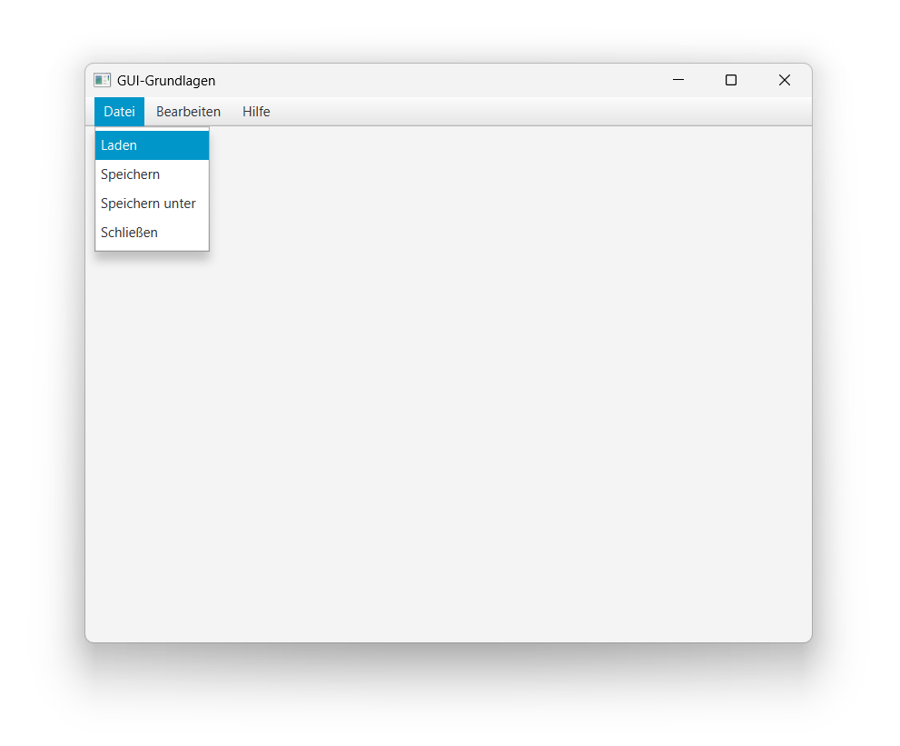
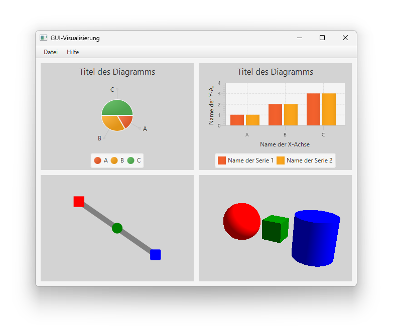

# Kurs in Java Programmierung

Dieses Repository enthält Unterlagen zum Kurs in Java-Programmierung, welcher an der [Fakultät für Technik und angewandte Naturwissenschaften](https://fh-ooe.at/campus-wels) (*engl.* School of Engineering) der [Fachhochschule Oberösterreich](https://fh-ooe.at/) unterrichtet wird.

*Beachte, dass sich der Kurs an Personen richtet, die bereits mit einer anderen objektorientierten Programmiersprache wie C# oder C++ umgehen können.*
*Deshalb verzichten wir auf die Einführung grundlegender Elemente von (objektorientierten) Programmiersprachen wie Datentypen, Operatoren, Literale, Variablen, Zuweisungen, Verzweigungen, Schleifen, Funktionen, Klassen, Methoden und Namensräume.*

Im Folgenden findest du **Grundlagen** der Java-Programmierung mit unterschiedlichen Standardbibliotheken, konkrete **Anwendungen** inklusive vollständigem Quelltext, und **Regelungen** zur Nutzung dieses Repositories.

## Grundlagen

Je nach konkreter Anwendungen kommen in der Regel verschiedene Bibliotheken und Frameworks zum Einsatz.
Im Rahmen dieses Kurses werden die folgenden Themen betrachtet:

* [Dateneingabe und -ausgabe mit `java.io`](./Grundlagen/Java.IO.md)
* [Netzwerk-Kommunikation mit `java.net`](./Grundlagen/Java.Net.md)
* [Grafische Benutzerschnittstellen mit `javafx`](./Grundlagen/JavaFX.md)
  * [*Vertiefung 1:* Steuerelemente](./Grundlagen/JavaFX-Controls.md)
  * [*Vertiefung 2:* 2D-Visualisierungen](./Grundlagen/JavaFX-2D.md)
  * [*Vertiefung 3:* 3D-Visualisierungen](./Grundlagen/JavaFX-3D.md)

## Anwendungen

Mit konkreten Beispielen lernt man doch am besten! Das Repository bietet dir die folgenden Beispiele, welche unterschiedliche Aspekte von Java wie Konsolen- und GUI-Entwicklung und IP-Kommunikation beleuchten:

### 💻 [Konsole-Taschenrechner](./Quellen/Konsole-Taschenrechner/)

Die erste Anwendung ist ein einfacher Taschenrechner, der die Grundrechenarten beherrscht.
Das Programm ließt vom Benutzer nacheinander zwei Zahlen und einen Rechenoperator ein.
Danach führt das Programm die gewünschte Berechnung durch und gibt das Ergebnis aus.
Zudem prüft das Programm die Gültigkeit der Eingaben, um die korrekte Funktion zu gewährleisten.
Bei ungültigen Eingaben gibt das Programm eine Fehlermeldung aus und wiederholt die Eingabe.

### 💻 [Konsole-UDP](./Quellen/Konsole-UDP/)

Die zweite Anwendung zeigt das Senden und Empfangen von UDP-Paketen.
Die Anwendung umfasst eine Client- und eine Serveranwendung, die separat gestartet werden müssen.
Die Clientanwendung fragt zunächst eine Eingabe vom Benutzer über die Konsole ab.
Danach erstellt die Anwendung ein UDP-Paket mit der Eingabe als Inhalt.
Schließlich sendet das Programm das Paket an eine vordefinierte IP-Adresse und eine vordefinierte Portnummer.

Die Serveranwendung wartet hingegen auf eingehende UDP-Pakete auf einer vordefinierten Portnummer.
Sobald ein UDP-Paket eingegangen ist, werden die Paketinformation auf der Konsole ausgegeben.
Die Paketinformationen beinhalten die IP-Adresse und die Portnummer des Paketsenders.
Des weiteren beinhalten die Paketinformationen den eigenliche Nutzinhalt sowie dessen Zeichenlänge.
Nachdem die Informationen ausgegeben wurden, terminiert die Anwendung.

Die folgende Grafik zeigt den technischen Aufbau der Anwendung bestehend aus einem Client und einem Server.
Sowohl der Client als auch der Server werden durch eine Programmklasse mit einer Hauptroutine dargestellt.
Beide Programmklassen nutzen wiederum die Klassen `DatagramSocket` zum Senden und Empfangen sowie `DatagramPacket` zur Darstellung von Datenpaketen.
Auf Clientseite enthält das Datenpaket die Adresse des Servers, auf Serverseite hingegen die Adresse des Clients.

### 💻 [GUI-Grundlagen](./Quellen/GUI-Grundlagen/)

Die dritte Anwendung dient der Einführung in die Entwicklung grafischer Benutzerschnittstellen mit dem JavaFX Framework. Dazu benötigen wir unter Anderem Apache Maven für die Projektverwaltung. Insbesondere ermöglich Apache Maven die deklarative Beschreibung von Abhängigkeiten zu anderen Bibliotheken (in diesem konkreten Fall OpenJFX), die nicht standardmäßig mit der Java Laufzeitumgebung ausgeliefert werden.

Die folgende Grafik zeigt die zugrunde liegende Objektstruktur der grafischen Anwendung.
An oberster Stelle der Struktur findet wir ein Randlayout, welches ein Menüband als Kindknoten enthält.
Das Menüband wiederum enthält drei verschiedene Menüs, welche aus unterschiedlichen Menüelementen bestehen.
Die Menüelemente verweisen schließlich auf Ereignisroutinen, welche bei deren Auswahl ausgeführt werden.
In den Ereignisroutinen kann man folglich die individuelle Funktionsweise der Menüelemente definieren.

### 💻 [GUI-Visualisierung](./Quellen/GUI-Visualisierung/)

Die vierte Anwendung zeigt Möglichkeiten auf, wie man in JavaFX Visualisierungen integrieren kann. Standardmäßig bietet JavaFX die Möglichkeit, einfache Diagrammvisualisierungen in Anwendungen zu integrieren. Darüber hinaus bietet JavaFX auch die Möglichkeit, eingene 2D- und 3D-Visualiserungen zu programmieren. Für eigene Visualisierungen steht ein entsprechendes Objektmodell bestehend aus 2D-Formen (Linien, Kreise, usw.) und 3D-Formen (Kugeln, Würfel, usw.) zur Verfügung.

Die folgende Grafik zeigt die zugrunde liegende Objektstruktur dieses Beispiels.
Der oberste Knoten der Objektstruktur ist ein Rasterlayout, welches vier Kindknoten beinhaltet.
Der erste Kindknoten ist das Tortendiagramm, welches in der linken oberen Rasterzelle zu sehen ist.
Der zweite Kindknoten ist das Balkendiagramm, welches in der rechten oberen Rasterzelle zu sehen ist.
Der dritte Kindknoten ist die 2D-Visualisierung, welche in der linken unteren Zelle zu sehen ist.
Und der vierte Kindknoten ist die 3D-Visualisierung, welche in der rechten unteren Zelle zu sehen ist.

### 💻 [GUI-Chat-UDP](./Quellen/GUI-Chat-UDP/)

Die fünfte Anwendung erweitert das vorige Beispiel zum Senden und Empfangen von UDP-Paketen um eine grafische Benutzerschnittstelle.
Die grafische Benutzerschnittstelle fragt zunächst den Namen des Nutzers, die gewünschte Portnummer für das Empfangen von Nachrichten, sowie die IP-Adresse und die Portnummer für das Senden von Nachrichten ab.
Danach kann der Benutzer Nachrichten eingeben und versenden.
Außerdem bekommt der Benutzer versendete und empfangene Nachrichten angezeigt.

Der folgende Screenshot zeigt den Aufbau der grafischen Benutzerschnittstelle bestehend aus einer Szene mit sogenannten Knoten.
JavaFX unterscheidet verschiedene Knotentypen wie Buttons, Texteingabefelder, Zahleneingabefelder und Beschriftungen (*rote* Kästen).
Des Weiteren bietet JavaFX bestimmte Knotentypen für das Layout von Kindelememten wie die Klassen `BorderPane`, `GridPane`, `ScrollPane` und `VBox` (*grüne* Kästen).
Beachte, dass der Stil jedes Knotens individuell konfiguriert werden kann.

Die folgende Grafik zeigt den schematischen Aufbau der grafischen Benutzeroberfläche als Knotenbaum.
Die Wurzel des Knotenbaums ist eine Instanz der Klasse `Stage`, welche das gesamte Fenster repräsentiert.
Eine `Stage` enthält wiederum genau eine Instanz der Klasse `Scene`, welche den Inhalt des Fensters darstellt.
Die `Scene` enthält schließlich genau ein Wurzelelement, welches in diesem konkreten Fall eine Instanz der Klasse `BorderPane` ist.
Das Wurzelelemnt kann dann weitere Knoten beinhalten.

## Regelungen

Die Unterlagen für diesen Kurs sind grundsätzlich quelloffen.
Im Folgenden findest du weitere Informationen zur Nutzung der Unterlagen sowie zur Weiterentwicklung des Materials:

* [LICENSE](./LICENSE.md)
* [CHANGELOG](./CHANGELOG.md)
* [CONTRIBUTING](./CONTRIBUTING.md)