# Kurs in Java Programmierung

Dieses Repository enthält Unterlagen zum Kurs in Java-Programmierung, welcher an der [Fakultät für Technik und angewandte Naturwissenschaften](https://fh-ooe.at/campus-wels) (*engl.* School of Engineering) der [Fachhochschule Oberösterreich](https://fh-ooe.at/) unterrichtet wird.

*Beachte, dass sich der Kurs an Personen richtet, die bereits mit einer anderen objektorientierten Programmiersprache wie C# oder C++ umgehen können.*
*Deshalb verzichten wir auf die Einführung grundlegender Elemente von (objektorientierten) Programmiersprachen wie Datentypen, Operatoren, Literale, Variablen, Zuweisungen, Verzweigungen, Schleifen, Funktionen, Klassen, Methoden und Namensräume.*

Im Folgenden findest du **Grundlagen** der Java-Programmierung mit unterschiedlichen Standardbibliotheken, konkrete **Anwendungen** inklusive vollständigem Quelltext, und **Regelungen** zur Nutzung dieses Repositories.

## Grundlagen

Je nach konkreter Anwendungen kommen in der Regel verschiedene Bibliotheken und Frameworks zum Einsatz.
Im Rahmen dieses Kurses werden die folgenden Themen betrachtet:

* [Dateneingabe und -ausgabe mit `java.io`](./Grundlagen/Java.IO.md)
* [Netzwerk-Kommunikation mit `java.net`](./Grundlagen/Java.Net.md)
* [Grafische Benutzerschnittstellen mit `javafx`](./Grundlagen/JavaFX.md)
  * [*Vertiefung 1:* Anordnung von Inhalten](./Grundlagen/JavaFX-Panes.md)
  * [*Vertiefung 2:* Interaktive Steuerelemente](./Grundlagen/JavaFX-Controls.md)
  * [*Vertiefung 3:* Darstellung von Datensammlungen](./Grundlagen/JavaFX-Collections.md)
  * [*Vertiefung 4:* Erstellung von 2D-Visualisierungen](./Grundlagen/JavaFX-2D.md)
  * [*Vertiefung 5:* Erstellung von 3D-Visualisierungen](./Grundlagen/JavaFX-3D.md)

## Anwendungen

*Mit konkreten Beispielen lernt man doch am besten!*
Das Repository bietet dir einfache Beispiele, um die Entwicklung von Anwendungen mit der Programmiersprache Java zu erlernen.
Im folgenden unterscheiden wir zwischen **Konsolenanwendungen**, welche typischerweise im Hintergrund laufen, sowie **grafischen Anwendungen (GUIs)**, mit denen die Benutzer direkt interagieren.

### Konsolenanwendungen

Dieser Abschnitt führt dich in die Entwicklung von Konsolenanwendungen mit der Programmiersprache Java ein und beinhaltet die folgenden Beispiele:

- Das **erste Beispiel** fokussiert sich auf die Eingabe und Ausgabe von Daten über die Konsole sowie die Umwandlung von Rohdaten und Zeichenketten.
- Das **zweite Beispiel** betrachtet hingegen die Kommunikation von Anwendungen über das IP-Netzwerke und das User Datagram Protocol.

#### 💻 [Konsole.IO](./Quellen/Konsole/IO/)

Die erste Anwendung ist ein einfacher Taschenrechner, der die Grundrechenarten beherrscht.
Das Programm ließt vom Benutzer nacheinander zwei Zahlen und einen Rechenoperator ein.
Danach führt das Programm die gewünschte Berechnung durch und gibt das Ergebnis aus.
Zudem prüft das Programm die Gültigkeit der Eingaben, um die korrekte Funktion zu gewährleisten.
Bei ungültigen Eingaben gibt das Programm eine Fehlermeldung aus und wiederholt die Eingabe.

Die folgende Grafik zeigt den technischen Aufbau der Taschenrechneranwendung.
Die Anwendung besteht aus einer Programmklasse mit einer Hauptroutine sowie weiteren Klassen für die Datenein- und -ausgabe.
Die Dateneingabe erfolgt über einen `BufferedReader`, mit dem ganze Zeilen eingelesen werden können.
Die Zeileneingabe basiert wiederum auf einem `InputStreamReader`, welche Eingaberohdaten in Zeichen mit einer Zeichenkodierung (z.B. UTF-8) verwandelt.
Die Zeicheneingabe nutzt schließlich die Standardeingabe, welche die notwendigen Rohdaten liefert.
Die Ausgabe erfolgt ebenso über die Standardausgabe der Konsolenanwendung, welche sowohl Rohdaten als auch Zeichenketten verarbeiten kann.

#### 💻 [Konsole.Net](./Quellen/Konsole/Net/)

Die zweite Anwendung zeigt das Senden und Empfangen von UDP-Paketen.
Die Anwendung umfasst eine Client- und eine Serveranwendung, die separat gestartet werden müssen.
Die Clientanwendung fragt zunächst eine Eingabe vom Benutzer über die Konsole ab.
Danach erstellt die Anwendung ein UDP-Paket mit der Eingabe als Inhalt.
Schließlich sendet das Programm das Paket an eine vordefinierte IP-Adresse und eine vordefinierte Portnummer.

Die Serveranwendung wartet hingegen auf eingehende UDP-Pakete auf einer vordefinierten Portnummer.
Sobald ein UDP-Paket eingegangen ist, werden die Paketinformation auf der Konsole ausgegeben.
Die Paketinformationen beinhalten die IP-Adresse und die Portnummer des Paketsenders.
Des weiteren beinhalten die Paketinformationen den eigenliche Nutzinhalt sowie dessen Zeichenlänge.
Nachdem die Informationen ausgegeben wurden, terminiert die Anwendung.

Die folgende Grafik zeigt den technischen Aufbau der Anwendung bestehend aus einem Client und einem Server.
Sowohl der Client als auch der Server werden durch eine Programmklasse mit einer Hauptroutine dargestellt.
Beide Programmklassen nutzen wiederum die Klassen `DatagramSocket` zum Senden und Empfangen sowie `DatagramPacket` zur Darstellung von Datenpaketen.
Auf Clientseite enthält das Datenpaket die Adresse des Servers, auf Serverseite hingegen die Adresse des Clients.

### Grafische Anwendungen (GUIs)

Dieser zweite Abschnitt beschäftigt sich mit der Entwicklung von grafischen Benutzerschnittstellen und Anwendungen mit der Programmiersprache Java und enthält die folgenden Beispiele:

- Das **erste Beispiel** beschreibt zunächst die unterschiedlichen möglichen Anordnungen von Inhalten auf der verfügbaren Bildschirmfläche.
- Das **zweite Beispiel** betrachtet die Erstellung von klassischen Menüstrukturen für Anwendungen sowie die Registrierung von Ereignisroutinen.
- Das **dritte Beispiel** fokussiert die Darstellung und Bearbeitung von eigenen Datensammlungen mit Listen-, Tabellen- und Baumansichten.
- Das **vierte Beispie**l erklärt die Erstellung von eigenen Datenvisualisierungen mit Diagrammen und grundlegenden 2D- und 3D-Grafikelementen.
- Das **fünfte Beispiel** zeigt schließlich die Entwicklung einer einfachen Chat-Anwendung basierend auf IP-Netzwerken und dem User Datagram Protocol.

#### 💻 [GUI.Anordnungen](./Quellen/GUI/Anordnungen/)

Die erste Anwendung erklärt, wie in JavaFX die Inhalte auf der verfügbaren Bildschirmfläche anordnen kann.
Für die Anordnung von Inhalten bietet JavaFX unterschiedliche Algorithmen, welche in Form von eigenen Knotentypen realisiert sind.
Die Algorithmen entscheiden wiederum automatisch, welcher Teil der Bildschirmfläche den einzelnen Inhalten zur Verfügung steht.
Der zugewiesene Teil der Bildschirmfläche ist durch die linke obere Bildschirmkoordinate sowie die Breite und Höhe der Fläche in Pixeln definiert.
Diese Informationen werden durch den verwendeten Algorithmus an die darunter liegenden Inhalte weitergegeben und dort letztlich zur Füllung der entsprechenden Bildschirmpixel verwendet.

Die folgende Grafik zeigt die interne Objektstruktur, welche dieser Beispielanwendung zugrunde leigt.
An oberster Stelle findet sich eine Rasteranordnung, um das gesamte Fenster in zwei Spalten und zwei Zeilen bzw. vier gleich große Zellen einzuteilen.
In die linke obere Zelle legen wir eine Randanordnung, welche aus fünf Bereichen (oben, links, mitte, rechts, unten) besteht.
In die linke untere Zelle legen wir eine Rasteranordnung, welche in diesem konkreten Fall aus drei gleich großen Spalten und zwei gleich großen Zeilen besteht und deren Inhalte teilweise zwei Spalten überspannen.
In die rechte obere Zelle legen wir eine Stapelanordnung, welche die Inhalte in der verfügbaren Fläche zentriert und in der vordefinierten Reihenfolge übereinander legt.
In die rechte untere Zelle legen wir schließlich eine Flußanorndung, welche die verfügbare Bildschirmfläche primär horizontal und sekundär vertikal mit Inhalten auffüllt.

#### 💻 [GUI.Menüs](./Quellen/GUI/Menüs/)

Die zweite Anwendung zeigt, wie man mit JavaFX klassische Menüstrukturen definiert und Ereignisroutinen für die einzelnen Menüpunkte hinterlegt.
Klassische Menüstrukturen bestehen grundsätzlich aus Menüs (z.B. Datei, Bearbeiten, und Hilfe) sowie Menüelementen (z.B. Öffnen, Speichern, Speichern unter, und Schließen).
Die übergeordneten Menüs können zunächst aufgeklappt und zugeklappt werden, die Menüelemente können hingegen ausgewählt werden und somit eine Aktion anstoßen.
Die Aktion selbst, welche angestoßen werden soll, wird schließlich als Ereignisroutine für das jeweilige Menüelementen gesetzt bzw. konfiguriert.

Die folgende Grafik zeigt die zugrunde liegende Objektstruktur der grafischen Anwendung.
An oberster Stelle der Struktur findet wir ein Randlayout, welches ein Menüband als Kindknoten enthält.
Das Menüband wiederum enthält drei verschiedene Menüs, welche aus unterschiedlichen Menüelementen bestehen.
Die Menüelemente verweisen schließlich auf Ereignisroutinen, welche bei deren Auswahl ausgeführt werden.
In den Ereignisroutinen kann man folglich die individuelle Funktionsweise der Menüelemente definieren.

#### 💻 [GUI.Sammlungen](./Quellen/GUI/Sammlungen/)

Die dritte Anwendung zeigt Möglichkeiten auf, wie man in JavaFX Sammlungen von Datensätzen anzeigen und bearbeitbar machen kann.
Grundsätzlich bietet JavaFX dafür eine Reihe unterschiedlicher Steuerelemente, welche abhängig vom konkreten Anwendungsfall eingesetzt werden können.
Zu den Steuerelementen für Datensammlungen gehören Listenansichten, Tabellenansichten, Baumansichten, und Baumtabellenansichten.
Listen und Tabellen eignen sich dabei für flache Datenstrukturen, während Baumansichten und Baumtabellenansichten für geschachtelte Datenstrukturen gedacht sind.

Die folgende Grafik zeigt die Objektstruktur, welche der Anwendung zugrunde liegt.
An oberster Stelle der Objektstruktur finden wir ein Rasterlayout, welches die verfügbare Bildschirmfläche unter den Kindknoten aufteilt.
Die Kindknoten selbst sind die Listenansicht, die Tabellenansicht, die Baumansicht, und die Baumtabellenansicht.
Die Listenansicht verweist des weiteren auf die Listenelemente, welche in der Ansicht dargestellt werden sollen.
Die Tabellenansicht beinhaltet neben den Tabellenelementen die Definition der einzelnen Spalten in From von Spaltenobjekten.
Die Baumansicht verweist hingegen ein Baumelement, welches den Wurzelknoten der Baumstruktur repräsentiert und weitere Kindelemente beinhalten kann.
Die Baumtabellenansicht definiert schließich sowohl die Tabellenspalten in From von Spaltenobjekten als auch den ein Baumelement als Wurzelknoten.

#### 💻 [GUI.Visualisierungen](./Quellen/GUI/Visualisierungen/)

Die vierte Anwendung zeigt Möglichkeiten auf, wie man in JavaFX Visualisierungen integrieren kann.
Standardmäßig bietet JavaFX die Möglichkeit, einfache Diagrammvisualisierungen in Anwendungen zu integrieren.
Darüber hinaus bietet JavaFX auch die Möglichkeit, eingene 2D- und 3D-Visualiserungen zu programmieren.
Für eigene Visualisierungen steht ein entsprechendes Objektmodell bestehend aus 2D-Formen (Linien, Kreise, usw.) und 3D-Formen (Kugeln, Würfel, usw.) zur Verfügung.

Die folgende Grafik zeigt die zugrunde liegende Objektstruktur dieses Beispiels.
Der oberste Knoten der Objektstruktur ist ein Rasterlayout, welches vier Kindknoten beinhaltet.
Der erste Kindknoten ist das Tortendiagramm, welches in der linken oberen Rasterzelle zu sehen ist.
Der zweite Kindknoten ist das Balkendiagramm, welches in der rechten oberen Rasterzelle zu sehen ist.
Der dritte Kindknoten ist die 2D-Visualisierung, welche in der linken unteren Zelle zu sehen ist.
Und der vierte Kindknoten ist die 3D-Visualisierung, welche in der rechten unteren Zelle zu sehen ist.

#### 💻 [GUI.Chat](./Quellen/GUI/Chat/)

Die fünfte Anwendung erweitert das vorige Beispiel zum Senden und Empfangen von UDP-Paketen um eine grafische Benutzerschnittstelle.
Die grafische Benutzerschnittstelle fragt zunächst den Namen des Nutzers, die gewünschte Portnummer für das Empfangen von Nachrichten, sowie die IP-Adresse und die Portnummer für das Senden von Nachrichten ab.
Danach kann der Benutzer Nachrichten eingeben und versenden.
Außerdem bekommt der Benutzer versendete und empfangene Nachrichten angezeigt.

Der folgende Screenshot zeigt den Aufbau der grafischen Benutzerschnittstelle bestehend aus einer Szene mit sogenannten Knoten.
JavaFX unterscheidet verschiedene Knotentypen wie Buttons, Texteingabefelder, Zahleneingabefelder und Beschriftungen (*rote* Kästen).
Des Weiteren bietet JavaFX bestimmte Knotentypen für das Layout von Kindelememten wie die Klassen `BorderPane`, `GridPane`, `ScrollPane` und `VBox` (*grüne* Kästen).
Beachte, dass der Stil jedes Knotens individuell konfiguriert werden kann.

Die folgende Grafik zeigt den schematischen Aufbau der grafischen Benutzeroberfläche als Knotenbaum.
Die Wurzel des Knotenbaums ist eine Instanz der Klasse `Stage`, welche das gesamte Fenster repräsentiert.
Eine `Stage` enthält wiederum genau eine Instanz der Klasse `Scene`, welche den Inhalt des Fensters darstellt.
Die `Scene` enthält schließlich genau ein Wurzelelement, welches in diesem konkreten Fall eine Instanz der Klasse `BorderPane` ist.
Das Wurzelelemnt kann dann weitere Knoten beinhalten.

## Regelungen

Die Unterlagen für diesen Kurs sind grundsätzlich quelloffen.
Im Folgenden findest du weitere Informationen zur Nutzung der Unterlagen sowie zur Weiterentwicklung des Materials:

* [LICENSE](./LICENSE.md)
* [CHANGELOG](./CHANGELOG.md)
* [CONTRIBUTING](./CONTRIBUTING.md)