# Kurs in Java Programmierung

Dieses Repository enthält Unterlagen zum Kurs in Java Programmierung an der [Fakultät für Technik und angewandte Naturwissenschaften](https://fh-ooe.at/campus-wels) (*engl.* School of Engineering) der [Fachhochschule Oberösterreich](https://fh-ooe.at/). Beachte, dass sich der Kurs an Personen richtet, die bereits mit einer anderen objektorientierten Programmiersprache wie C# oder C++ umgehen können. Deshalb verzichten wir auf die Einführung grundlegender Elemente von (objektorientierten) Programmiersprachen wie Datentypen, Operatoren, Literale, Variablen, Zuweisungen, Verzweigungen, Schleifen, Funktionen, Klassen, Methoden und Namensräume.

Die nachstehenden Inhalte sind wie folgt gegliedert:

* Beispiele
* Themen
* Dokumente

## Beispiele

Mit konkreten Beispielen lernt man doch am besten! Das Repository bietet dir die folgenden Beispiele, welche unterschiedliche Aspekte von Java wie Konsolen- und GUI-Entwicklung und IP-Kommunikation beleuchten:

* [Konsole-Taschenrechner](./Quellen/Konsole-Taschenrechner/)
* [Konsole-Chat](./Quellen/Konsole-Chat/)

## Themen

TODO

* Input/Output
* IP-Kommunikation
* GUI-Programmierung

### Input/Output

TODO

* Byte Input/Output
* Char Input/Output

#### Byte Input/Output

TODO

TODO

#### Char Input/Output

TODO

TODO

### IP-Kommunikation

TODO

* User Datagram Protocol (UDP)
* Transmission Control Protocol (TCP)

#### User Datagram Protocol (UDP)

TODO

#### Transmission Control Protocol (TCP)

TODO

### GUI-Programmierung

TODO

## Dokumente

* [Änderungen](./CHANGELOG.md)
* [Beitragen](./CONTRIBUTING.md)
* [Lizenz](./LICENSE.md)